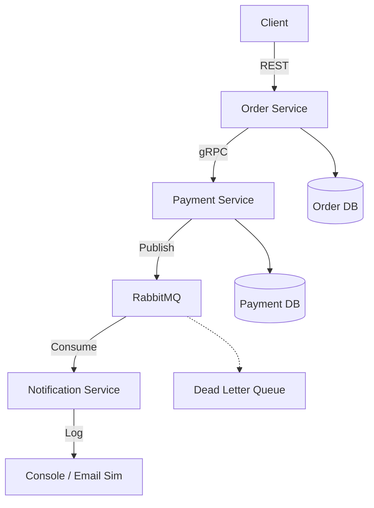

# AP2 Assignment 3 — Event-Driven Architecture (EDA)

This repository contains the solution for Assignment 2, demonstrating the migration from REST inter-service communication to gRPC using a Contract-First approach.

## 🔗 Contract-First Repositories
The gRPC contracts (`.proto` files) and their generated Go code are maintained in external repositories as per clean architecture principles:
- **Proto definitions:** [microservices-order-payment-contracts-proto](https://github.com/Meirzhan1/microservices-order-payment-contracts-proto)
- **Generated Go code:** [microservices-order-payment-contracts-generated](https://github.com/Meirzhan1/microservices-order-payment-contracts-generated)

## 🚀 Features & Requirements Covered
- **Order Service:** Maintains REST API and gRPC updates stream. Now passes `customer_email` to Payment Service.
- **Payment Service:** Publishes `payment.completed` event to RabbitMQ after successful payment.
- **Notification Service:** Asynchronously consumes payment events and simulates sending emails.
- **RabbitMQ:** Acts as the message broker with durable queues and manual acknowledgments.
- **Dead Letter Queue (DLQ):** Implemented for handling failed message processing.
- **Idempotency:** Notification service filters duplicate messages based on Order ID.
- **Graceful Shutdown:** All services handle termination signals to close connections properly.
- **Docker Compose:** Full environment orchestration.

## 🏛 Architecture

```mermaid
flowchart TD
  Client -->|REST| O[Order Service]
  O -->|gRPC| P[Payment Service]
  P -->|Publish| RMQ[RabbitMQ]
  RMQ -->|Consume| N[Notification Service]
  N -->|Log| Console[Console / Email Sim]
  
  O --> ODB[(Order DB)]
  P --> PDB[(Payment DB)]
  
  RMQ -.-> DLQ[Dead Letter Queue]
```

### 4. Running with Docker Compose
```bash
docker-compose up --build
```

## 🛠 Engineering Decisions

### Idempotency Strategy
The Notification Service uses an in-memory `sync.Map` to store processed Order IDs. Before processing a message, it checks if the ID exists. If it does, the message is acknowledged and skipped. 
*(Note: This in-memory map is used for simplicity in this assignment. In a production system, this state would be persisted in Redis or a Database to survive service restarts).*

### Routing & Exchange
Instead of relying purely on default exchanges, the system explicitly declares a `direct` exchange (`payment.exchange`). The queue is bound to this exchange with a specific routing key. This allows for flexible and scalable routing (e.g., adding a `fanout` or `topic` exchange later) without changing the consumer logic.

### Manual Acknowledgments (ACKs)
Manual ACKs are enabled in the Notification Service (`auto-ack: false`). A message is only acknowledged (`d.Ack(false)`) after the simulated email is logged. If the service crashes during processing, RabbitMQ will requeue the message.

### Reliability & DLQ
- **Durable Queues & Persistent Messages:** All queues are declared as durable to survive broker restarts, and messages are published with `amqp.Persistent` delivery mode.
- **Outbox Pattern Concept:** The producer implements a retry mechanism. If publishing fails critically, an error is returned up the stack. *In a true production environment, an Outbox Pattern would be implemented to guarantee message delivery even if the broker is temporarily down.*
- **Consumer Error Handling & Prefetch:** The consumer uses a Prefetch (QoS) count of 1 for fair distribution. If processing fails (or a panic is recovered), the message is explicitly `Nack`ed and requeued (`d.Nack(false, true)`).
- **DLQ:** If unmarshaling fails or a permanent error occurs, the message is `Nack`ed without requeue, moving it to the Dead Letter Exchange and then to the DLQ.
