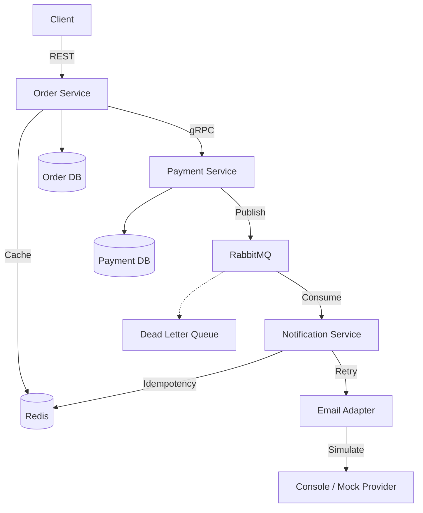

# AP2 Assignment 4 — Performance Optimization & External Integrations

This repository contains the solution for Assignment 4, demonstrating performance optimization through Redis caching and resilient external integrations using the Adapter pattern and reliable background workers.

## 🔗 Contract-First Repositories
The gRPC contracts (`.proto` files) and their generated Go code are maintained in external repositories:
- **Proto definitions:** [microservices-order-payment-contracts-proto](https://github.com/Meirzhan1/microservices-order-payment-contracts-proto)
- **Generated Go code:** [microservices-order-payment-contracts-generated](https://github.com/Meirzhan1/microservices-order-payment-contracts-generated)

## 🚀 Assignment 4 Features
- **Redis Caching (Order Service):**
    - **Cache-aside pattern:** Reduces DB pressure by caching order details.
    - **TTL:** 5-minute expiration for cache keys.
    - **Atomic Invalidation:** Cache is cleared immediately after any order status update.
- **Reliable Background Worker (Notification Service):**
    - **Adapter Pattern:** Decouples notification logic from providers (Mock/Simulated).
    - **Exponential Backoff Retries:** Automatically retries failed email sends with increasing delays (2s, 4s, 8s...).
    - **Redis Idempotency:** Prevents duplicate processing by tracking `payment_id` in Redis.
- **Bonus: API Rate Limiter:**
    - Gin middleware using Redis to limit requests per IP (10 requests/min).
- **Docker Compose:** Updated to include a healthy Redis container.

## 🏛 Architecture Diagram

```mermaid
flowchart TD
  Client -->|REST| O[Order Service]
  O -->|Cache| R[(Redis)]
  O -->|gRPC| P[Payment Service]
  P -->|Publish| RMQ[RabbitMQ]
  RMQ -->|Consume| N[Notification Service]
  N -->|Idempotency| R[(Redis)]
  N -->|Retry| Adapter[Email Adapter]
  Adapter -->|Simulate| Console[Console / Mock Provider]
  
  O --> ODB[(Order DB)]
  P --> PDB[(Payment DB)]
  
  RMQ -.-> DLQ[Dead Letter Queue]
```

## 🛠 Engineering Decisions

### 1. Invalidation Strategy (Cache-aside)
We use a **delete-on-update** strategy. Whenever an order's status changes (e.g., from `Pending` to `Paid` after payment, or to `Cancelled`), the corresponding Redis key `order:{id}` is deleted. This ensures that the next `GET` request fetches fresh data from the database and repopulates the cache, preventing "stale data" issues.

### 2. Reliable Background Jobs & Retries
The Notification Service is a **truly asynchronous worker**. It consumes events from RabbitMQ and uses an `EmailSender` adapter. 
- **Retry Logic:** If the external provider (mocked) returns an error, the worker uses an **Exponential Backoff** strategy. This prevents overwhelming a struggling provider while giving it time to recover.
- **Backoff Formula:** `delay = 2^attempt * base_delay`.

### 3. Idempotency with Redis
Instead of an in-memory map, we now use Redis to store the status of processed payments. Before sending a notification, the worker checks if `notification:payment:{payment_id}` exists. If it does, the job is skipped as a duplicate. This ensures system consistency even across service restarts.

## 🚀 Running the System
1. **Docker Compose:**
   ```bash
   docker-compose up --build
   ```
2. **Environment Variables:**
   Configure `.env` for TTL, Retry counts, and Provider mode (REAL/SIMULATED).

## 🛠 Verification
- **Caching:** First `GET /orders/:id` is ~10ms (DB), second is ~1ms (Redis).
- **Rate Limiting:** Send 11 requests in 1 minute to see `429 Too Many Requests`.
- **Retries:** Check logs of `notification-service` to see backoff delays during simulated failures.
